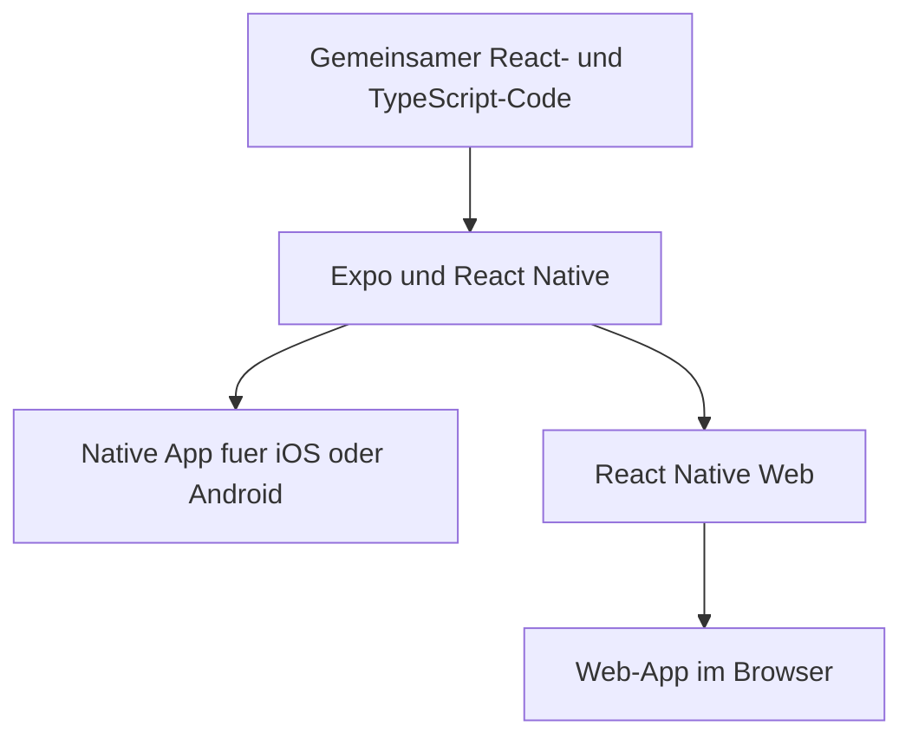

# Was ist Expo

[Expo](https://docs.expo.dev/core-concepts/) ist ein Open-Source-Framework rund um React
Native. Damit lassen sich Apps fuer Android, iOS und das Web aus einer gemeinsamen
JavaScript- oder TypeScript-Codebasis entwickeln. Expo bringt Werkzeuge fuer Entwicklung,
Geraetefunktionen und Builds mit. Bei [Fitty]() nutze ich es
fuer die Oberflaeche auf dem iPhone und im Browser.

## React, React Native und Expo

Die Begriffe beschreiben unterschiedliche Teile derselben Anwendung:

| Baustein | Aufgabe |
| --- | --- |
| React | Beschreibt die Oberflaeche als Komponenten und aktualisiert sie, wenn sich Daten oder Zustand aendern. |
| React Native | Verbindet diese Komponenten auf Android und iOS mit nativen Bedienelementen und Geraetefunktionen. |
| Expo SDK | Liefert aufeinander abgestimmte Bibliotheken, etwa fuer Kamera, Bildauswahl oder Dateien. |
| Expo CLI | Startet die Entwicklungsumgebung und unterstuetzt beim Installieren passender Pakete und beim Bauen der App. |
| Expo Router | Organisiert die Navigation anhand von Dateien und Ordnern. |

Beim [Expo Router](https://docs.expo.dev/router/introduction/) steht beispielsweise eine
Datei `src/app/profile.tsx` fuer die Profilseite unter `/profile`. Layout-Dateien bestimmen,
wie Seiten zusammengehoeren, etwa in einer Tab-Navigation. Diese Struktur kann auf dem
Handy und im Browser genutzt werden.

## Wie aus dem Code eine App wird

Eine mobile App besteht aus JavaScript fuer Oberflaeche und Logik sowie einem nativen Teil
fuer das jeweilige Betriebssystem. Der native Teil startet die JavaScript-Laufzeit, zeigt
native Komponenten an und stellt Geraetefunktionen bereit. Expo kann die benoetigten
Android- und iOS-Projekte aus der App-Konfiguration erzeugen; dieser Schritt heisst
*Prebuild*. Die [Workflow-Dokumentation](https://docs.expo.dev/workflow/overview/) erklaert
dieses Zusammenspiel.



Fuer den Browser bildet [React Native Web](https://docs.expo.dev/workflow/web/) gemeinsame
Komponenten wie `View` und `Text` auf HTML-Elemente ab. So koennen viele Ansichten und
Funktionen geteilt werden. Kamera, Dateizugriff oder Bedienung unterscheiden sich trotzdem
je nach Plattform und muessen dort getestet werden.

## So laeuft die Entwicklung

In einem eingerichteten Expo-Projekt mit installierten Abhaengigkeiten startet dieser
Befehl den Entwicklungsserver:

```sh
npx expo start
```

Danach oeffnet man das Projekt auf einem verbundenen Geraet, im Emulator oder Simulator.
Mit `w` laesst sich die Web-Version starten. Der Entwicklungsserver liefert den
JavaScript-Code an die jeweilige Laufzeit. Aenderungen an Komponenten werden durch
*Fast Refresh* meist direkt sichtbar. Der
[Einstieg in die Entwicklung](https://docs.expo.dev/get-started/start-developing/)
beschreibt auch die Verbindung zum Smartphone.

## Expo Go und Development Builds

Zum Ausfuehren des Codes auf einem Smartphone braucht es eine installierte App. Dabei gibt
es zwei unterschiedliche Wege:

| Variante | Wofuer sie gedacht ist |
| --- | --- |
| Expo Go | Fertige App zum Lernen und Ausprobieren. Sie bringt einen festen Satz nativer Bibliotheken mit; das Projekt muss dazu passen. |
| Development Build | Eigene Entwicklungsversion der App, ueblicherweise mit `expo-dev-client`. Sie enthaelt die nativen Bibliotheken und Einstellungen des eigenen Projekts. |

Fuer eine eigene App empfiehlt Expo
[Development Builds](https://docs.expo.dev/develop/development-builds/introduction/).
Reine JavaScript-Aenderungen brauchen normalerweise keinen neuen nativen Build. Kommt eine
native Bibliothek hinzu oder aendert sich die native Konfiguration, muss die App neu
gebaut werden.

## Builds, Veroeffentlichung und Updates

Ein Produktions-Build erzeugt die App fuer die spaetere Nutzung ohne Entwicklungsserver.
[Lokale Builds](https://docs.expo.dev/guides/local-app-development/) benoetigen fuer iOS
macOS und Xcode, fuer Android die Android-Werkzeuge. Alternativ kann der native Build auf
einem Build-Server laufen.

Dafuer bietet Expo optionale Cloud-Dienste an:
[Expo Application Services, kurz EAS](https://docs.expo.dev/eas/).
**EAS Build** baut und signiert mobile Apps, **EAS Submit** laedt sie zu den App Stores hoch.
Fuer die Web-Version gibt es **EAS Hosting**. Expo laesst sich auch ohne diese Dienste nutzen;
der Web-Export kann beispielsweise auf eigener Infrastruktur bereitgestellt werden.

Mit [EAS Update](https://docs.expo.dev/eas-update/introduction/) lassen sich kompatible
JavaScript- und Asset-Aenderungen an bereits installierte Apps ausliefern, wenn die App
dafuer eingerichtet ist. Aenderungen am nativen Code oder an nativen Abhaengigkeiten
brauchen weiterhin einen neuen App-Build. Ein Update muss zur nativen Laufzeit der
installierten Version passen.

## Was Expo bei Fitty uebernimmt

Bei Fitty liegen Tageschat, Profil und Tagesuebersicht in der gemeinsamen Expo-Oberflaeche.
Expo Router uebernimmt die Navigation. Pakete wie `expo-image-picker` und
`expo-image-manipulator` helfen bei Bildauswahl und Aufbereitung der Fotos.

Die weitere Verarbeitung liegt im Go-Backend. Supabase stellt Anmeldung, Datenbank und
Bildspeicher bereit, die KI-Auswertung laeuft ueber die OpenAI API. Wie die Teile
zusammenpassen, steht auf der [Fitty-Projektseite]().

Der Nutzen fuer dieses Projekt: Ich kann viel Oberflaechenlogik gemeinsam pflegen und
trotzdem eine mobile App und eine Browser-Version bauen. Ob Bildauswahl, Tastatur und
Navigation auf dem iPhone genauso gut funktionieren, muss ich auf dem Geraet pruefen.
