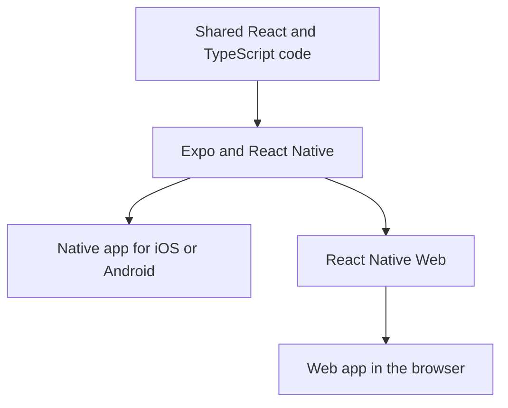

# What Expo Is

[Expo](https://docs.expo.dev/core-concepts/) is an open-source framework built around React
Native. It lets you develop apps for Android, iOS, and the web from a shared JavaScript or
TypeScript codebase. Expo provides tools for development, device features, and builds.
In [Fitty](), I use it for the interface on the iPhone and in
the browser.

## React, React Native, and Expo

These names describe different parts of the same application:

| Component | Purpose |
| --- | --- |
| React | Describes the interface as components and updates it when data or state changes. |
| React Native | Connects those components to native controls and device features on Android and iOS. |
| Expo SDK | Provides compatible libraries for features such as the camera, image selection, and files. |
| Expo CLI | Starts the development environment and helps install compatible packages and build the app. |
| Expo Router | Organizes navigation through files and folders. |

With [Expo Router](https://docs.expo.dev/router/introduction/), a file such as
`src/app/profile.tsx` represents the profile screen at `/profile`. Layout files define how
screens fit together, for example in a tab navigator. This structure can be shared between
the phone and the browser.

## How the code becomes an app

A mobile app combines JavaScript for its interface and logic with a native part for the
operating system. The native part starts the JavaScript runtime, renders native components,
and provides device features. Expo can generate the required Android and iOS projects from
the app configuration, a step called *Prebuild*. The
[workflow documentation](https://docs.expo.dev/workflow/overview/) explains how these parts
work together.



In the browser, [React Native Web](https://docs.expo.dev/workflow/web/) maps shared
components such as `View` and `Text` to HTML elements. This makes it possible to reuse many
screens and features. Camera access, file handling, and interaction still differ between
platforms and need to be tested on each one.

## The development loop

In a configured Expo project with its dependencies installed, this command starts the
development server:

```sh
npx expo start
```

Then open the project on a connected device, in an emulator, or in a simulator. Press `w`
to start the web version. The development server delivers JavaScript to the selected
runtime. *Fast Refresh* usually makes component changes visible immediately. The
[development guide](https://docs.expo.dev/get-started/start-developing/) also explains how
to connect a phone.

## Expo Go and development builds

Running the code on a phone requires an installed app. There are two different options:

| Option | Intended use |
| --- | --- |
| Expo Go | A ready-made app for learning and experimenting. It includes a fixed set of native libraries, which the project must be compatible with. |
| Development build | Your own development version of the app, usually with `expo-dev-client`. It contains the native libraries and settings needed by your project. |

Expo recommends [development builds](https://docs.expo.dev/develop/development-builds/introduction/)
when building your own app. JavaScript-only changes usually do not require a new native
build. Adding a native library or changing native configuration means rebuilding the app.

## Builds, distribution, and updates

A production build produces the app for use without a development server.
[Local builds](https://docs.expo.dev/guides/local-app-development/) require macOS and Xcode
for iOS, or the Android tools for Android. Alternatively, the native build can run on a
build server.

Expo offers optional cloud services for this:
[Expo Application Services, or EAS](https://docs.expo.dev/eas/).
**EAS Build** compiles and signs mobile apps, while **EAS Submit** uploads them to the app
stores. **EAS Hosting** handles the web version. Expo can also be used without these
services; for example, the web export can be hosted on your own infrastructure.

[EAS Update](https://docs.expo.dev/eas-update/introduction/) can deliver compatible
JavaScript and asset changes to installed apps when the app is configured for it. Changes
to native code or native dependencies still require a new app build. An update must match
the native runtime of the installed version.

## What Expo does in Fitty

In Fitty, the daily chat, profile, and daily overview live in the shared Expo interface.
Expo Router handles navigation. Packages such as `expo-image-picker` and
`expo-image-manipulator` help select and prepare photos.

Further processing happens in the Go backend. Supabase provides authentication, the
database, and image storage; AI analysis uses the OpenAI API. The
[Fitty project page]() describes how these parts fit together.

The benefit for this project is that I can maintain much of the interface logic in one
place while building both a mobile app and a browser version. Whether image selection,
the keyboard, and navigation work equally well on an iPhone needs testing on the device.
